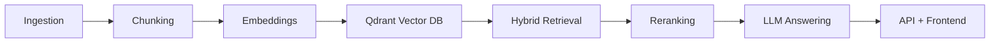

# Enterprise RAG Document Q&A System 🚀

A production-grade RAG system for enterprise knowledge across PDFs, DOCX, Confluence/wiki pages, and TXT files. It combines hybrid retrieval (dense + BM25), cross-encoder reranking, and NVIDIA AI Foundation Models for grounded answers with citations.

## Table of Contents 📚

- [🌟 Project Overview](#-project-overview)
- [🎯 What Makes This Project Special](#-what-makes-this-project-special)
- [🏗️ System Architecture Overview](#%EF%B8%8F-system-architecture-overview)
- [📂 Project Structure](#-project-structure)
- [🛠️ Technology Stack](#%EF%B8%8F-technology-stack)
- [🚀 Quick Start Guide](#-quick-start-guide)
- [📋 Prerequisites](#-prerequisites)
- [⚙️ Installation Guide](#%EF%B8%8F-installation-guide)
- [🔧 Running the Project](#-running-the-project)
- [📊 Retrieval & Answering Strategy](#-retrieval--answering-strategy)
- [🧪 Evaluation](#-evaluation)
- [💬 Example Queries](#-example-queries)
- [🔐 Security & Best Practices](#-security--best-practices)
- [🆘 Troubleshooting](#-troubleshooting)
- [📞 Contact & Support](#-contact--support)

## 🌟 Project Overview

This project delivers a complete, interview-ready RAG system: document ingestion, semantic chunking, hybrid retrieval, reranking, and citation-backed answers through a FastAPI backend and Streamlit UI.

## 🎯 What Makes This Project Special

- 🏗️ Production-grade pipeline with hybrid retrieval and reranking
- 🔄 End-to-end flow from ingestion to grounded answers
- 🌐 Multi-source support: PDF, DOCX, HTML/MD, and TXT
- 📊 Real-world evaluation metrics included
- 📖 Beginner-friendly structure and documentation

## 🏗️ System Architecture Overview



## 📂 Project Structure

```
RAG_chatbot/
    data/                 - Local document sources for ingestion
        pdfs/               - PDF files and converted PDFs
        words/              - DOCX files
    src/ingestion/        - Load PDFs, DOCX, HTML/MD, and TXT into raw documents
    src/chunking/         - Split documents into overlapping semantic chunks
    src/embeddings/       - Embed chunks and queries
    src/vectordb/         - Qdrant storage, indexing, and search helpers
    src/retrieval/        - Hybrid retrieval (dense + BM25) with filters
    src/reranking/        - Cross-encoder reranking for precision
    src/llm/              - NVIDIA Llama API client and QA prompt builder
    src/api/              - FastAPI routes and request/response schemas
    src/frontend/         - Streamlit chat UI
    src/evaluation/       - Metrics and benchmark scripts
    src/utils/            - Config, logging, caching, and dedup helpers
    src/index.py          - CLI indexer to load and embed documents
    README.md             - Project documentation
    Dockerfile            - API container build
    docker-compose.yml    - Local Qdrant stack
    .env.example          - Environment variable template
```

## 🛠️ Technology Stack

- 🐍 Python
- ⚡ FastAPI
- 🧠 NVIDIA AI Foundation Models (Llama)
- 🧩 sentence-transformers embeddings
- 🗄️ Qdrant vector database
- 🔍 BM25 + Cross-encoder reranking
- 🖥️ Streamlit UI

## 🚀 Quick Start Guide

1. Set environment variables in `.env` (repo root).
2. Install dependencies.
3. Start Qdrant.
4. Index documents.
5. Run the API and UI.

## 📋 Prerequisites

- Python 3.10+
- Docker (for Qdrant)
- NVIDIA API key

## ⚙️ Installation Guide

```
pip install -r requirements.txt
```

## 🔧 Running the Project

Start Qdrant:

```
docker run -p 6333:6333 -p 6334:6334 qdrant/qdrant:latest
```

Index documents:

```
python -m src.index --source /path/to/docs
```

Start the API:

```
uvicorn src.api.main:app --reload
```

Start the Streamlit UI:

```
streamlit run src/frontend/app.py
```

## 📊 Retrieval & Answering Strategy

- Retrieve top 15 chunks via hybrid search (dense + BM25)
- Rerank with a cross-encoder
- Send top 5 chunks to the LLM with citations

## 🧪 Evaluation

```
python -m src.evaluation.benchmark
```

## 💬 Example Queries

- What is the VPN access policy and who approves exceptions?
- Summarize the incident response escalation path.
- Where are Kubernetes deployment steps documented?

## 🔐 Security & Best Practices

- Use environment variables for secrets
- Validate inputs on ingestion and query
- Log retrieval and reranking decisions for auditability

## 🆘 Troubleshooting

- If Streamlit shows "No documents indexed yet", ingest documents via the UI or restart the API after ingestion.
- If Qdrant errors on large payloads, reduce the batch size in the upsert config.

## 📞 Contact & Support

- Email: pavansai87654321@gmail.com
- GitHub: @Pavansai20054

